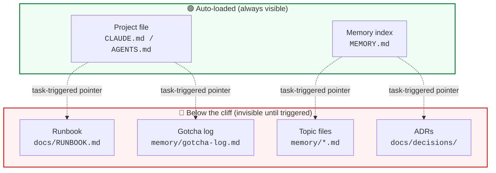
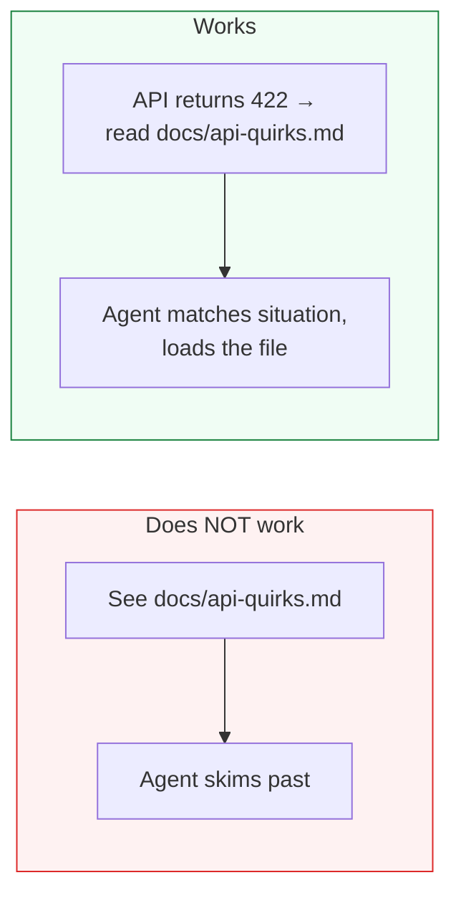

# The Auto-Loading Cliff

The single most important concept: **there is a hard line between what your agent sees automatically and what's invisible.**



## What this means

Content above the cliff is **always available** — your agent acts on it from the first message. Content below is **invisible** until something triggers the agent to read it.

"Linked prominently" is not a trigger. The agent skims past links.

## What crosses the cliff

**Task-triggered pointers** cross it. The difference:



| Doesn't cross the cliff | Crosses the cliff |
|--------------------------|-------------------|
| `See docs/RUNBOOK.md` | `Before changing the pipeline, read docs/RUNBOOK.md` |
| `API troubleshooting` | `API returns 422` |
| `Architecture docs` | `Making an architectural decision` |

The first column uses **categories** the agent has to interpret. The second uses **situations** the agent recognizes it's in. Categories require judgment. Situations are match conditions.

## Where to put pointers

Two places, both auto-loaded:

1. **Project file** — "Before You Start" table:
   ```markdown
   | When | Read |
   |------|------|
   | Debugging or investigating failures | `memory/gotcha-log.md` — problem-fix archive |
   | Making architectural decisions | `docs/adr/README.md` — index of ADRs |
   | Touching PII or sensitive data | `memory/privacy-protocol.md` — never-do list |
   ```

2. **Memory index** — Topic file table:
   ```markdown
   | File | When to load | Key insight |
   |------|-------------|-------------|
   | `memory/api-quirks.md` | API returns unexpected errors | Pagination limits, auth token expiry |
   | `memory/infrastructure.md` | Deployment or staging issues | Timeout workarounds, env differences |
   ```

Both tables use the same principle: **when** (situation), **what** (file), **why** (one-line hint so the agent knows if it's worth loading).

---

Next: [The Layers →](02-the-layers.md)
