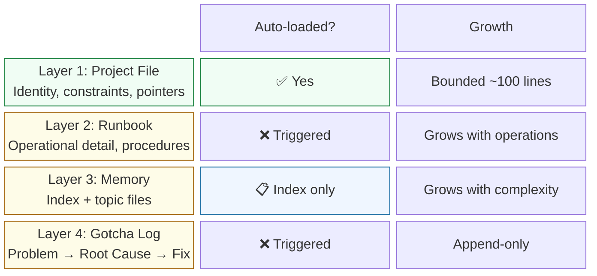
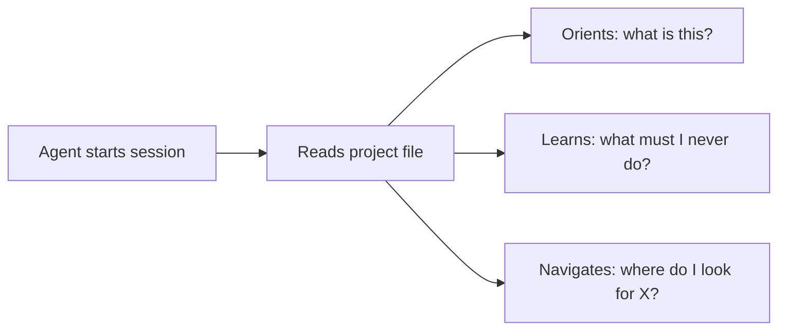
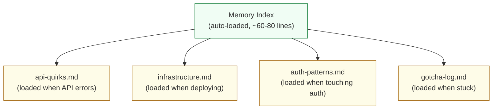
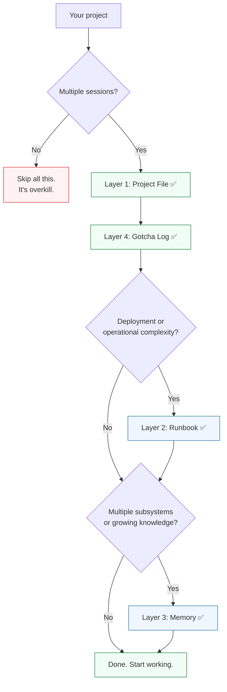

# The Layers

Four layers, each added when the previous one gets crowded. Not every project needs all four.



## Layer 1: Project File — always present

**What it is:** The only file guaranteed to be read every session. Your agent's first impression.

**What goes in:**
- Project identity (3-5 lines: what, who, why)
- Hard constraints ("never remove output fields", "never skip tests")
- "Before You Start" table with task-triggered pointers
- Architecture sketch (directory tree)
- Key file paths (10-15 most needed)
- How to work here (test, build, deploy commands)

**Keep it under ~100 lines.** Every line competes for attention.



## Layer 2: Runbook — most projects need this

**What it is:** Operational detail that would clutter the project file.

**What goes in:**
- Local development setup (prerequisites, commands)
- Deployment steps and gates
- How to add new [extension point]
- Common problems (symptom → cause → fix)

**Skip if:** Your project has one test command and no deployment.

## Layer 3: Memory — when complexity grows

**What it is:** An auto-loaded index pointing to on-demand topic files.



The index carries:
- Topic file routing table (file | when to load | key insight)
- Current project state
- Recently promoted patterns
- Key file paths
- Active decisions

Topic files carry deep knowledge about one subsystem. **The index is the bridge across the cliff for everything in Layer 3.**

## Layer 4: Gotcha Log — always present

**What it is:** Structured problem/solution journal. Append-only.

```markdown
### Staging migrations time out (2026-01-15)
**Problem**: Migrations hang after ~30 seconds on staging.
**Root cause**: Shared database has long-running queries holding locks.
**Fix**: Run with `--lock-timeout=60s`.
```

**Not a daily journal.** "Today we did X, Y, Z" is noise. "Problem → Root Cause → Fix" is knowledge.

## Which layers does your project need?



## Tool mapping

The layers are the same everywhere. Only the filenames change.

| Layer | Claude Code | Codex | Cursor | Windsurf | Copilot |
|-------|-----------|-------|--------|----------|---------|
| 1. Project file | `CLAUDE.md` | `AGENTS.md` | `.cursor/rules/*.mdc` | `.windsurfrules` | `.github/copilot-instructions.md` |
| 2. Runbook | `docs/RUNBOOK.md` | same | same | same | same |
| 3. Memory index | `MEMORY.md` | — | — | — | — |
| 3. Topic files | `memory/*.md` | same | same | same | same |
| 4. Gotcha log | `memory/gotcha-log.md` | same | same | same | same |

Tools without auto-memory (everything except Claude Code): put everything Layer 3 would carry into the project file. It becomes your only auto-loaded file, so make it a lean index.

---

[← The Cliff](01-the-cliff.md) | Next: [The Loop →](03-the-loop.md)
