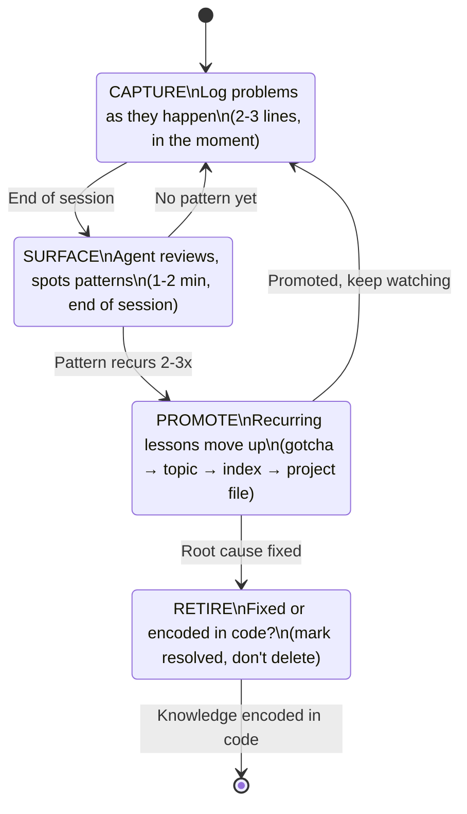
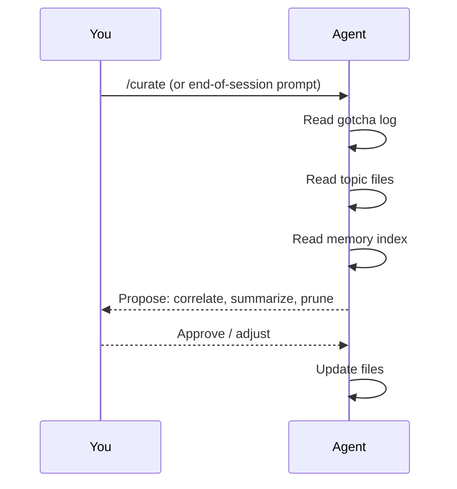
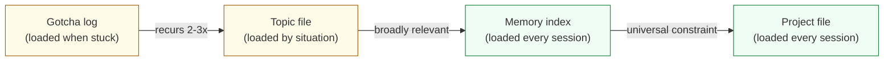

# The Self-Learning Loop

Context isn't a one-time documentation effort. It's a living system with four phases.



## Phase 1: Capture

**When:** During work, the moment something goes wrong or surprises you.

**What:** Append a quick entry to the gotcha log. Three lines is enough.

```markdown
### Staging migrations time out (2026-01-15)
**Problem**: Migrations hang after ~30 seconds on staging.
**Root cause**: Shared database has long-running queries holding locks.
**Fix**: Run with `--lock-timeout=60s`.
```

Also note non-obvious learnings in topic files, and write ADRs when choosing between approaches.

**The key insight:** Cheap to capture in the moment. Expensive to reconstruct later.

## Phase 2: Surface

**When:** End of session. 1-2 minutes.

**What:** The agent reviews what was captured and proposes updates. You review and approve.



The agent does four things:
- **Freshness check** — Verify references still exist, flag stale memory and lingering gotchas from previous sessions
- **Correlate** — Link entries that stem from the same root cause
- **Summarize** — Five timeout gotchas → "this API is unreliable under load"
- **Prune** — Flag stale entries for removal
- **Doc sync** — Verify project file, runbook, and backlog match the current repo state

**You don't write from recall.** The agent drafts; you review.

## Phase 3: Promote

**When:** A lesson recurs 2-3 times across sessions.

**Where it moves:** Each promotion increases visibility.



**Promotion format:** Always as "if [situation], then [what to do]" — not a narrative.

**Example lifecycle:**

| Session | What happens | Where it lives |
|---------|-------------|----------------|
| 4 | Migration times out. Logged. | Gotcha log |
| 7 | Times out again. Agent flags it. | Gotcha log |
| 8 | Promoted: "if migrations time out, use `--lock-timeout=60s`" | `memory/infrastructure.md` |
| 15 | Affects deployments, backfills, and test setup too | Memory index |
| 22 | Database moved to dedicated instance. Fixed. | Marked `[RESOLVED]` |

Total effort: ~2 minutes across 6 sessions. The lesson was visible at the right level for each phase of its life.

## Phase 4: Retire

**When:** The root cause is fixed, the code is refactored, or the lesson is encoded in the codebase itself.

**What to do:**
- Mark gotcha log entries `[RESOLVED]` (don't delete — it's history)
- Remove topic file entries for refactored-away behavior
- Remove memory index entries that are now in the project file or code

**Monthly audit:** Deep audit — the agent scans all memory for drift, proposes batch retirements, and checks ground truth designations still hold. You review and confirm. Pruning should roughly match growth — if memory only grows, it's accumulating noise. (Basic staleness is now caught every session via the freshness check in `/curate`.)

---

[← The Layers](02-the-layers.md) | Next: [The Rhythm →](04-the-rhythm.md)
