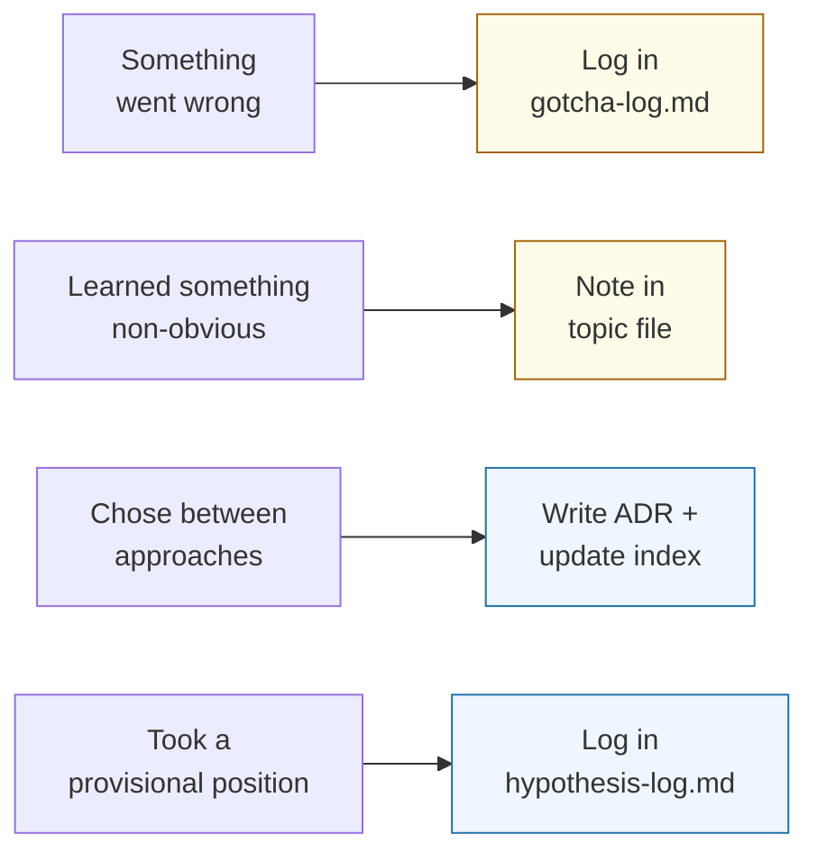
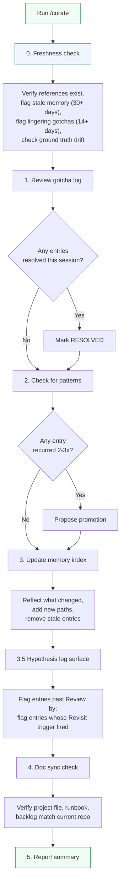

# The Rhythm

When to do what. Three timescales, each with a clear trigger.

```mermaid
gantt
    title Documentation rhythm across sessions
    dateFormat X
    axisFormat %s

    section During work
    Log gotchas (2-3 lines)       :active, 0, 1
    Note learnings in topic files :active, 0, 1
    Write ADRs for decisions      :active, 0, 1

    section End of session
    Agent curates (you review)    :crit, 1, 2

    section Monthly
    Agent audits all memory       :2, 3
```

## During work: capture in the moment

**Trigger:** Something goes wrong, surprises you, or you make a decision.

**Time cost:** Seconds. You're writing 2-3 lines, not a report.

**The rule:** If you'd explain it to a colleague arriving tomorrow, write it down now. If it's obvious from the code, don't.

**A provisional position is different from a decision.** An ADR captures a choice you've already made with rationale frozen. A hypothesis log entry captures a bet whose evidence lives in the future — "we think X will happen by date Y; we'll know we were wrong if we see Z." See [`templates/hypothesis-log.md`](../../templates/hypothesis-log.md) for the format.

**Why bother?** Without a hypothesis log, provisional bets either drift into ADRs (over-committing) or get forgotten (under-revisiting). With one, you pin the falsification criterion *before* the data lands — hard discipline against post-hoc rationalization. `/curate` surfaces due entries automatically so you don't have to remember.

## End of session: curate (1-2 minutes)

**Trigger:** You're about to close the session.

**How:** Run `/curate` (Claude Code) or paste the curate prompt.

**You don't write from recall.** The agent reads the session context, drafts consolidations, and proposes changes. You review and approve. This is 1-2 minutes of review, not 20 minutes of writing.

## Monthly: deep audit

**Trigger:** Calendar reminder, or the memory index feels cluttered.

Basic staleness is now caught every session via the freshness check in `/curate`. The monthly audit goes deeper:

**What the agent does:**
- Scans all memory files for factual drift (not just missing paths)
- Flags entries where the root cause was fixed
- Flags entries now encoded in code
- Checks ground truth designations still hold
- Proposes batch retirements

**What you do:** Review and confirm. The monthly audit should prune roughly as much as it adds. If memory only grows, it's accumulating noise.

## The full picture

```mermaid
flowchart TD
    subgraph during["During work"]
        W["Work happens"]
        W --> Gotcha["Gotcha? → Log it"]
        W --> Learn["Learned? → Topic file"]
        W --> Decide["Decision? → ADR"]
    end

    subgraph eos["End of session (1-2 min)"]
        Curate["/curate"]
        Curate --> Fresh["Freshness check<br/>(catch rot from previous sessions)"]
        Fresh --> Correlate["Correlate related entries"]
        Curate --> Summarize["Summarize repeated lessons"]
        Curate --> Prune["Flag stale entries"]
        Curate --> Promote["Promote recurring patterns"]
        Curate --> DocSync["Doc sync check<br/>(project file, runbook, backlog)"]
    end

    subgraph monthly["Monthly"]
        Audit["Agent audits all memory"]
        Audit --> Retire["Retire fixed/encoded entries"]
        Audit --> Verify["Verify all paths still exist"]
    end

    during --> eos
    eos --> monthly
    monthly -.-> during

    style during fill:#fefce8,stroke:#a16207
    style eos fill:#f0fdf4,stroke:#16803c
    style monthly fill:#eff6ff,stroke:#1d6fa5
```

## What success looks like

| Signal | Meaning |
|--------|---------|
| New sessions start productive in the first exchange | Context is working |
| Agents don't re-investigate solved problems | Gotcha log is being used |
| Same problem rarely appears 3+ times | Promotion is working |
| Memory files don't grow indefinitely | Retirement is working |
| You stop saying "go read X first" | Task-triggered pointers are working |

| Warning sign | Meaning |
|-------------|---------|
| Explaining the same thing every session | Something is below the cliff that shouldn't be |
| Project file exceeds 150 lines | Time to split into layers |
| Same gotcha appears 3+ times | Promotion isn't happening |
| Memory only grows, never shrinks | Retirement isn't happening |
| References point to files that no longer exist | Freshness check isn't running |

---

[← The Loop](03-the-loop.md) | [Back to README](../../README.md)
