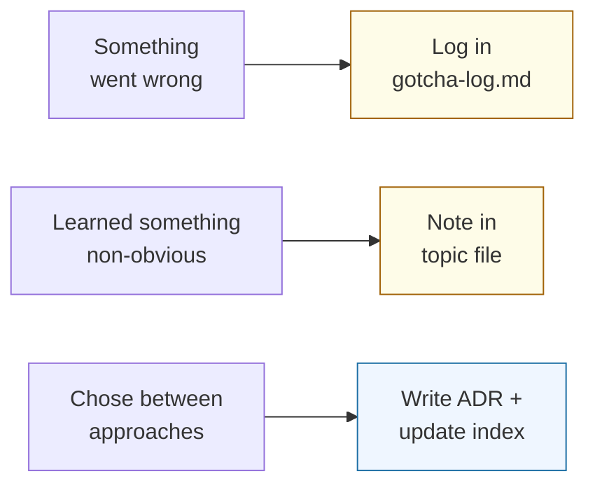
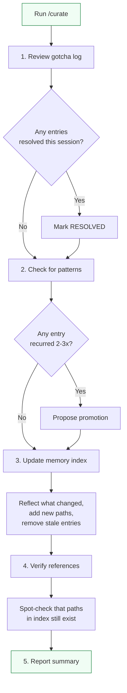
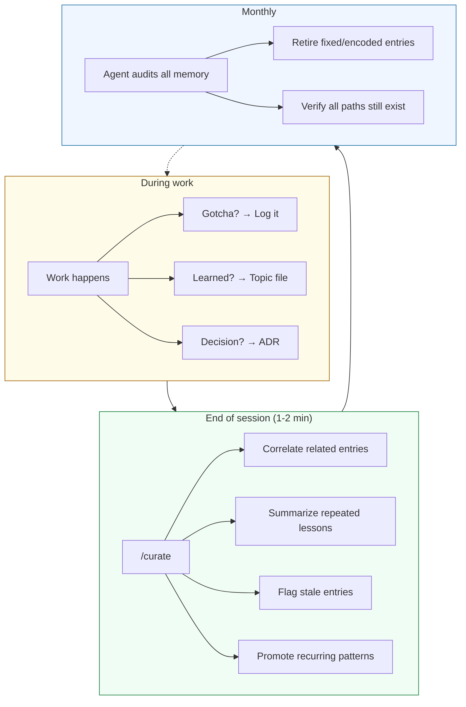

# The Rhythm

When to do what. Three timescales, each with a clear trigger.

```mermaid
gantt
    title Documentation rhythm across sessions
    dateFormat X
    axisFormat %s

    section During work
    Log gotchas (2-3 lines)       :active, 0, 1
    Note learnings in topic files :active, 0, 1
    Write ADRs for decisions      :active, 0, 1

    section End of session
    Agent curates (you review)    :crit, 1, 2

    section Monthly
    Agent audits all memory       :2, 3
```

## During work: capture in the moment

**Trigger:** Something goes wrong, surprises you, or you make a decision.

**Time cost:** Seconds. You're writing 2-3 lines, not a report.

**The rule:** If you'd explain it to a colleague arriving tomorrow, write it down now. If it's obvious from the code, don't.

## End of session: curate (1-2 minutes)

**Trigger:** You're about to close the session.

**How:** Run `/curate` (Claude Code) or paste the curate prompt.

**You don't write from recall.** The agent reads the session context, drafts consolidations, and proposes changes. You review and approve. This is 1-2 minutes of review, not 20 minutes of writing.

## Monthly: audit and retire

**Trigger:** Calendar reminder, or the memory index feels cluttered.

**What the agent does:**
- Scans all memory files
- Flags entries where the root cause was fixed
- Flags entries now encoded in code
- Flags stale facts that no longer match the codebase
- Proposes batch retirements

**What you do:** Review and confirm. The monthly audit should prune roughly as much as it adds. If memory only grows, it's accumulating noise.

## The full picture

## What success looks like

| Signal | Meaning |
|--------|---------|
| New sessions start productive in the first exchange | Context is working |
| Agents don't re-investigate solved problems | Gotcha log is being used |
| Same problem rarely appears 3+ times | Promotion is working |
| Memory files don't grow indefinitely | Retirement is working |
| You stop saying "go read X first" | Task-triggered pointers are working |

| Warning sign | Meaning |
|-------------|---------|
| Explaining the same thing every session | Something is below the cliff that shouldn't be |
| Project file exceeds 150 lines | Time to split into layers |
| Same gotcha appears 3+ times | Promotion isn't happening |
| Memory only grows, never shrinks | Retirement isn't happening |

---

[← The Loop](03-the-loop.md) | [Back to README](../../README.md)
